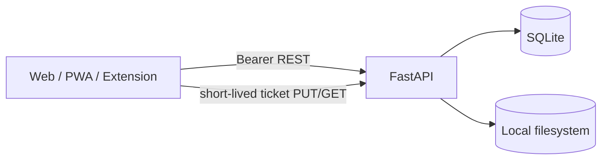
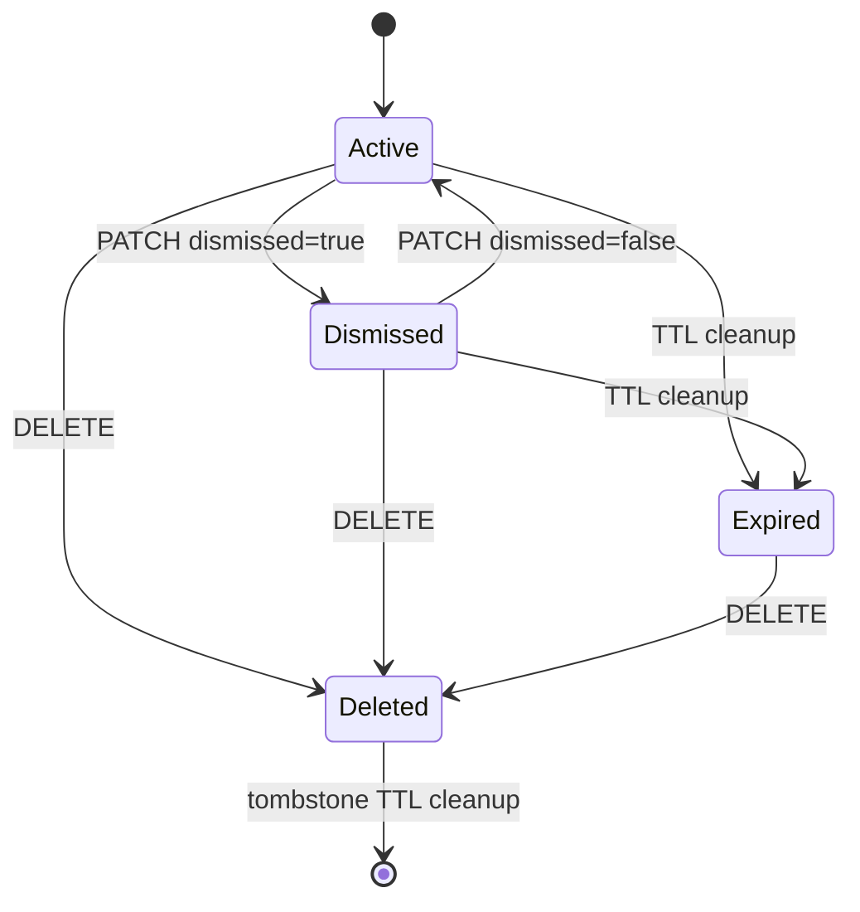
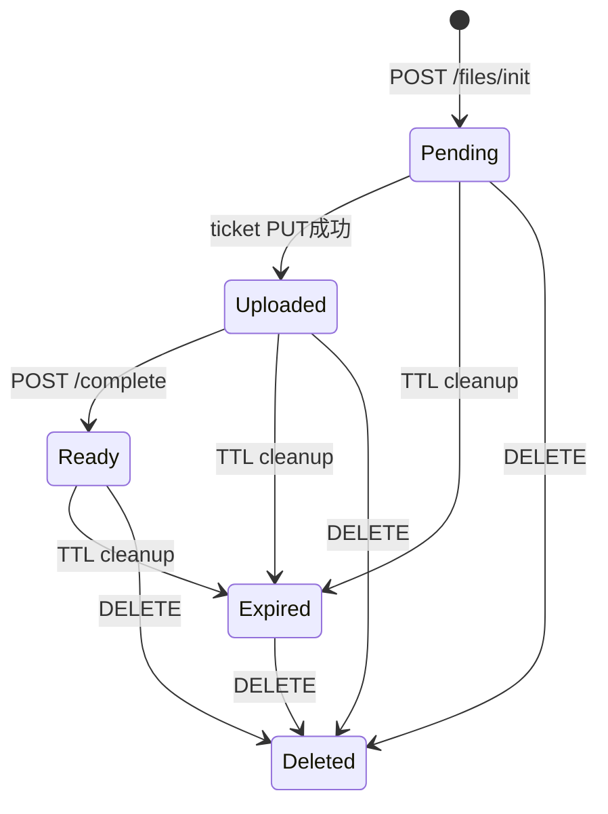
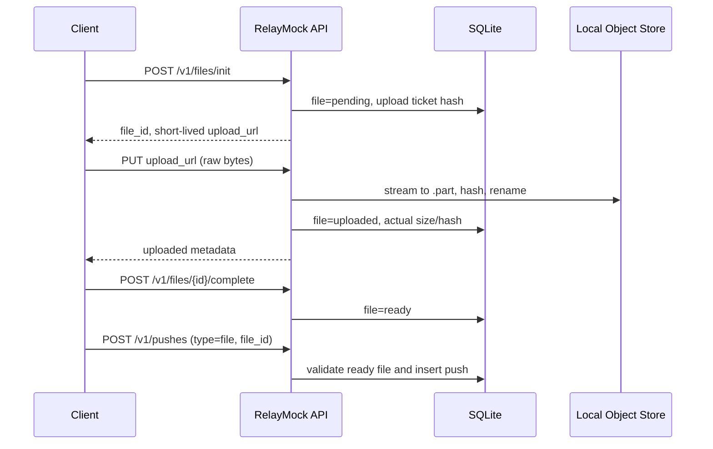

# RelayMock REST API 0.1.1 設計書

## 1. 目的

RelayMockは、Webアプリ、PWA、ブラウザ拡張機能から利用する端末間Pushサービスを、Cloudflare環境へ接続する前にローカルで開発・結合試験するためのモックREST APIである。

クライアントから見た主要なAPI形状を本番想定とそろえながら、実行環境を次のように単純化する。



| 本番想定 | RelayMock |
|---|---|
| Cloudflare Worker | FastAPI / Uvicorn |
| D1 | SQLite |
| R2 | ローカルディスク |
| R2署名付きURL | ハッシュ保存した短寿命Bearer Ticket |
| Durable Objects WebSocket | 実装せず、カーソル同期で代替 |
| Web Push配送 | Subscription登録状態のみ保存 |
| Cron Trigger | asyncio定期cleanupと管理API |

## 2. 設計目標

1. note、link、file Pushのクライアント実装を完成できること。
2. 1ユーザー内の全端末、他の全端末、特定端末を表現できること。
3. 通信再試行でPushを重複作成しないこと。
4. 一時的な通知欠落があってもREST差分同期だけで復旧できること。
5. ファイル本体を通常のJSON APIへ通さず、署名URL相当のフローを試せること。
6. TTL、削除墓標、端末失効など、クライアントが扱う境界状態を再現できること。
7. 後でFastAPI部分をCloudflare Workerへ置換しても、クライアント変更を最小化できること。

## 3. 非目標

- インターネットへ公開できる認証品質
- パスキーまたはOAuthの完全実装
- E2EE鍵生成、端末間鍵移送、復旧キー
- 実際のWeb Push送信
- WebSocketのリアルタイム配送
- マルウェアスキャン
- 分散トランザクション、マルチリージョン整合性
- Cloudflare無料枠の計測・縮退制御

`/v1/auth/bootstrap`は開発専用である。`/v1/mock/*`のRouterは既定では登録せず、明示的な開発設定時だけ有効化する。いずれも外部公開しない。

## 4. コンポーネント

### 4.1 FastAPIアプリケーション

責務は次のとおり。

- OpenAPIと入力・出力スキーマ
- Bearer Token認証
- Push、端末、ファイル、Subscription API
- CORS
- Request ID
- 定期cleanup

各ルーターは状態を直接保持せず、`request.app.state`に設定されたDatabaseとSettingsを依存注入で取得する。テストでは一時ディレクトリを使うSettingsでアプリケーションを生成する。

### 4.2 SQLite

- 接続はリクエスト単位で開閉する。
- `foreign_keys=ON`を使用する。
- WALモードを使用し、ポーリングと書き込みの重なりを扱いやすくする。
- SQL値はすべてプレースホルダーでバインドする。
- TokenとTicketは平文ではなくSHA-256を保存する。

SQLiteはローカルモックの正本である。ファイルの存在よりDBの状態を優先する。

### 4.3 ローカルオブジェクトストレージ

`storage_dir/<user_id>/<file_id>.bin`へ保存する。オブジェクトキーにはユーザー入力を使わない。元ファイル名はメタデータとしてのみ保存し、ダウンロード時に安全な名前へ正規化する。

アップロードは一時ファイルへストリーミングし、サイズとSHA-256を確認してからatomic renameする。

## 5. 認証モデル

### 5.1 Bootstrap

```text
POST /v1/auth/bootstrap
```

ユーザー、最初の端末、端末スコープのBearer Tokenを一括生成する。Tokenはレスポンスで一度だけ平文を返し、DBにはハッシュだけを残す。平文Token応答には`Cache-Control: no-store`と`Pragma: no-cache`を必ず付ける。

### 5.2 端末追加

```text
POST /v1/devices/link
```

認証済み端末が、承認済みの端末リンクを模擬する。追加端末専用Tokenを発行し、Bootstrapと同じキャッシュ禁止Headerを付ける。`max_devices`へ達した場合は409を返す。本番ではこの部分をパスキー承認、QRコード、PKCEなどへ置換する。

### 5.3 端末失効

端末を失効すると、その端末の全Sessionを削除し、Web Push Subscriptionも失効する。以後そのTokenは401となる。

最後の1台はモック上では失効できない。アカウント削除フローを実装していないためである。

## 6. データモデル

### 6.1 users

| 列 | 意味 |
|---|---|
| `id` | `usr_...`形式の内部ID |
| `handle` | ローカルで一意な識別名 |
| `created_at` | UTC ISO 8601 |

### 6.2 devices

| 列 | 意味 |
|---|---|
| `id` | `dev_...` |
| `user_id` | 所有ユーザー |
| `kind` | web、pwa、browser_extension、test |
| `name` | ユーザー表示名 |
| `public_key` | 将来のE2EE用。モックでは任意文字列 |
| `last_seen_at` | 最大1分に1回更新 |
| `revoked_at` | 失効墓標 |

### 6.3 sessions

端末TokenのSHA-256、ユーザー、端末、有効期限を保存する。Token文字列自体は保存しない。

### 6.4 pushes

| 列 | 意味 |
|---|---|
| `source_device_id` | 送信元端末 |
| `target_kind` | `all_other_devices`、`all_devices`、`device` |
| `target_device_id` | 特定端末宛の場合のみ使用 |
| `type` | note、link、file |
| `file_id` | file Pushでサーバーが添付状態を検証する非秘密メタデータ |
| `payload_json` | 平文モック用Payload |
| `ciphertext` / `nonce` | E2EEクライアント形状を先行試験するための欄 |
| `client_guid` | 冪等性キー |
| `request_hash` | 同じ冪等性キーの異内容再利用を検出 |
| `modified_at` / `id` | 差分同期カーソルの複合キー |
| `expires_at` / `expired_at` | TTL |
| `dismissed_at` | 全端末共通のdismiss状態 |
| `deleted_at` | soft delete墓標 |

1つのPushを端末数分複製しない。アカウント内で1行を共有し、レスポンスの`is_for_current_device`で現在端末への配送対象かを示す。

### 6.5 files

ファイル状態、オブジェクトキー、宣言サイズ、実サイズ、SHA-256、TTLを保存する。

### 6.6 tickets

UploadとDownloadの短寿命Credential。DBにはToken Hashだけを保存する。

- Upload Ticketは1回使用したら失効する。
- Download Ticketは期限までは再利用できる。R2署名付きGET URLに近い挙動である。

### 6.7 web_push_subscriptions

ブラウザから受け取る`endpoint`、`p256dh`、`auth`を保存するが、配送は行わない。`device_id + endpoint`でupsertし、初回は201、再登録は鍵を更新して200とする。クライアントの登録・解除画面とAPI呼び出しを先に開発するためのモックである。


### 6.8 論理Payload v1

`PushCreate`はOpenAPI上も実装上も、次の6種類の相互排他的な`oneOf`である。

1. note plaintext
2. note ciphertext + nonce
3. link plaintext
4. link ciphertext + nonce
5. file plaintext + top-level `file_id`
6. file ciphertext + nonce + top-level `file_id`

plaintextは`NotePayloadV1`、`LinkPayloadV1`、`FilePayloadV1`のいずれかであり、`additionalProperties=false`とする。`payload`と`ciphertext`は同時指定できず、ciphertextにはnonceが必須である。note／linkは`file_id`を持てず、fileは必須である。

## 7. Push状態遷移



優先状態は`deleted > expired > dismissed > active`である。Pinnedは状態ではなく独立フラグであり、レスポンスの`status`はactiveまたはdismissedのままになる。Pinすると`expires_at`をNULLにしてTTL遷移を停止し、Unpinするとその時点から既定TTLを設定する。

期限切れ時はPayload、ciphertext、nonceを消去し、`modified_at`を更新する。期限切れ後にPinして本文を復元することはできないため409を返す。

## 8. ファイル状態遷移



### 8.1 送信シーケンス



`file_id`はE2EEでPayload全体を暗号化してもトップレベルに残す。これによりサーバーは、存在しないファイルや未完了ファイルを参照するPushを拒否できる。ファイル名、MIME型などの秘密情報はciphertextへ含められる。Push応答には`id`、`state`、`size`、`expires_at`だけを持つ非秘密の`file_ref`を付ける。Fileがuploaded、ready、expired、deletedへ変化した場合、参照Pushの`modified_at`も更新し、通常のカーソル同期へ再投入する。

## 9. 冪等性

`POST /v1/pushes`は次の優先順で冪等性キーを決める。

1. `Idempotency-Key`ヘッダー
2. Bodyの`client_guid`
3. サーバー生成値

初回リクエストは201、同一キー・同一内容の再送は200と`Idempotent-Replayed: true`を返す。

キーだけ同じで内容が異なる場合は409 `idempotency_conflict`とする。比較対象は、宛先、type、file_id、payload version、Payloadまたはciphertext、nonce、解決済みTTLである。

## 10. 差分同期

```text
GET /v1/pushes?after=<cursor>&limit=100&include_deleted=true
```

Cursorは次の配列をJSON化してBase64 URL-safe encodingした不透明値である。

```json
["2026-07-13T12:34:56.123456Z", "psh_..."]
```

SQL条件は次の形になる。

```sql
WHERE user_id = :user_id
  AND (
    modified_at > :modified_at
    OR (modified_at = :modified_at AND id > :id)
  )
ORDER BY modified_at, id
LIMIT :limit_plus_one
```

### 10.1 レスポンス規則

```json
{
  "items": [],
  "next_cursor": null,
  "has_more": false
}
```

- 1件以上返した場合、`next_cursor`は常に最後の項目を示す。
- `has_more=true`なら、同じ同期処理内ですぐ次ページを取る。
- `has_more=false`でも`next_cursor`を永続化し、次回ポーリングの`after`に使う。
- 0件ならCursorを進めず、クライアントが保持する既存Cursorをそのまま使う。
- 同じPush IDを再受信した場合は`modified_at`の新しい方でupsertする。
- 同期用途では`include_deleted=true`を使い、delete墓標をローカルへ適用する。

WebSocketを後から追加しても、それは同期開始のtickleに過ぎない。正本はこのREST同期であり、通知欠落時も復旧できる。

## 11. 主なHTTP契約

| 状態 | Status | 例 |
|---|---:|---|
| 作成成功 | 201 | 初回Push、Bootstrap、Subscription |
| 冪等再送 | 200 | 同一Push再送 |
| 認証失敗 | 401 | Tokenなし、失効端末、期限切れSession |
| Ticket不正 | 403 | 存在しないTicket、使用済みUpload Ticket、管理Token不正 |
| Ticket期限切れ | 410 | 期限切れupload／download ticket |
| 対象なし | 404 | 他ユーザーまたは存在しないID |
| 状態競合 | 409 | 未Uploadファイルのcomplete、異内容の冪等キー |
| 期限切れ | 410 | 期限切れファイル |
| サイズ超過 | 413 | ファイルまたはPush Payload上限超過 |
| 検証失敗 | 422 | Body形式、Uploadサイズ・Hash不一致 |

エラーBodyは原則として次の形式である。

```json
{
  "detail": {
    "code": "file_not_ready",
    "message": "The file is not available for download.",
    "request_id": "req_..."
  }
}
```

同じ値を`X-Request-ID`応答Headerへ付ける。Pydantic入力検証エラーはFastAPI標準の422形式を維持するが、HeaderのRequest IDは付与する。


### 11.1 CapabilitiesとWeb Push設定

`GET /v1/system/capabilities`は、API version、environment ID、機能フラグ、ファイル／Payload上限、TTL候補、最大端末数、transport、推奨poll間隔を返す。PWAと拡張機能はこれを正本とし、上限をハードコードしない。

`GET /v1/web-push-config`はSubscription登録可否、実配送可否、VAPID公開鍵を返す。RelayMockでは登録可、配送不可を明示する。

## 12. TTLとcleanup

cleanupは次の2経路で実行される。

1. `cleanup_interval_seconds`ごとのasyncio task
2. `POST /v1/mock/cleanup`

加えて、期限の影響を受ける主要APIの冒頭でもcleanupを呼ぶ。これにより定期taskを無効にしたテストでも、期限切れ状態を観測できる。

処理内容は次のとおり。

- Pushをexpired化し、本文を消去して`modified_at`を進める。
- Fileをexpired化し、オブジェクトを削除する。
- 期限切れTicketは短期間保持し、Endpointが「無効なTicket」403と「期限切れTicket」410を区別できるようにする。保持期間を過ぎたTicketだけを削除する。
- `tombstone_ttl_seconds`を超えたdeleted Pushを物理削除する。

## 13. セキュリティ境界

ローカルモックでも、クライアントが誤った前提を持たないよう次を実装する。

- Bearer TokenとTicketはHash保存
- User IDをすべての所有権検索条件へ含める
- Target Deviceが同じユーザーの有効端末か検証
- ファイルオブジェクトキーをサーバー生成
- ファイル名をパスへ使用しない
- Uploadをストリーミングし、宣言サイズを超えた時点で中止
- SHA-256の任意検証
- CORS許可元を環境変数化
- 管理APIに別Header Token。Router自体を既定で無効化
- Request IDを全レスポンスへ付加し、APIエラー本文にも格納
- Token平文応答のキャッシュ禁止

一方、Bootstrapが誰でも呼べること、実際の端末承認がないことから、管理Routerを無効にしていても外部公開は安全ではない。

## 14. テスト戦略

`tests/`は一時SQLiteと一時オブジェクトディレクトリを使用し、次を検証する。

- Health check
- Bearer Token必須
- 端末追加と特定端末宛Push
- 同内容の冪等再送
- 同一キー・異内容の409
- Cursor paginationとcheckpoint
- Push TTL、Payload消去、期限切れ後のPin拒否
- File init、Upload、complete、file Push、download
- 端末失効後の401
- 管理statsとreset
- OpenAPIの共通エラー、binary body、oneOf、date-time、uri-reference
- CapabilitiesとWeb Push設定
- Subscription upsertの201／200
- File状態変更による`file_ref`カーソル再同期
- Request IDとToken応答no-store

テストは実Socketを開かずFastAPI TestClientで行う。別途、Uvicorn起動後に`scripts/demo_client.py`で実HTTPのスモークテストを行う。

## 15. 本番構成への置換境界

| RelayMock | 本番実装 |
|---|---|
| `Database.connection()`内のSQL | D1 prepared statementまたはRepository |
| `data/objects` | Private R2 |
| `/mock-storage/uploads/*` | R2署名付きPUT URL |
| `/mock-storage/downloads/*` | R2署名付きGET URL |
| Bootstrap | Passkey / OAuth / approved link |
| cleanup task | Cron Trigger + R2 Lifecycle |
| REST polling | REST polling + Durable Objects tickle |
| Subscription保存のみ | VAPID Web Push送信 |
| `payload`許可 | 公開ベータ前にciphertextのみへ制限 |

クライアントが依存すべきものは、API Path、JSON Schema、HTTP Status、Cursor規則、冪等性規則である。ローカルのSQLiteやTicket実装詳細には依存させない。

## 16. 将来拡張

優先度順の候補は次のとおり。

1. `/v1/events`のlong polling
2. WebSocket tickle
3. Fault injection（遅延、429、500、切断）
4. OpenAPIからTypeScript SDK生成
5. User間Conversation
6. Channelと購読者Cursor
7. Passkey認証のローカル実装
8. E2EE参照クライアント

## 17. OpenAPI契約

OpenAPI 3.1は実際のHTTP動作と同じ契約を持つ。

- `POST /v1/pushes`は201に加え、冪等再送の200と`Idempotent-Replayed: true`を記述する。
- `ApiErrorDetail`と`ApiError`を共通Schemaとし、401、403、404、409、410、413を`components.responses`から参照する。
- upload PUTのrequest bodyとdownload GETのresponse bodyは`application/octet-stream`、`format: binary`とする。
- 全UTC日時は`format: date-time`、ticket URLは相対URLも許容する`format: uri-reference`とする。
- 管理Routerを有効化したOpenAPIでは`X-Mock-Admin`を必須Headerとして記述する。
- 全OperationのResponseへ`X-Request-ID` Headerを公開契約として追加する。
- Token発行Responseは`Cache-Control`と`Pragma`もHeader契約へ含める。

静的`openapi.json`は管理Endpointも含む完全な開発契約を生成するため、生成時だけ`RELAYMOCK_ENABLE_MOCK_ADMIN=true`を設定する。通常起動時は管理Routerを登録しない。
