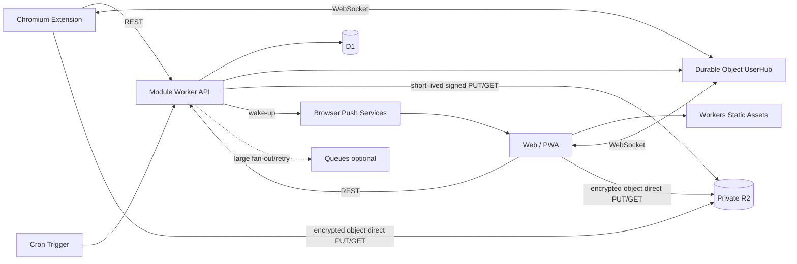

# RelayPush 統合実装計画

仕様基準日: 2026-07-21  
Cloudflare料金・制限の参照日: 2026-07-13

## 1. 目的

Pushbulletの中核的な利用体験を、Web、PWA、ブラウザ拡張機能だけで再構成する。低廉な運用を最優先し、Cloudflare無料枠を最大限利用する。ファイルの保持期間を短くする、配信規模に上限を設ける、無料枠逼迫時にファイル機能から縮退することは許容する。

## 2. 対象機能

MVPに含める。

- 自分の全端末または特定端末へのNote送信
- 現在のページ、リンク、選択テキストのLink送信
- 短期ファイル共有
- 端末一覧、名称変更、失効
- 履歴、dismiss、delete、pin
- ブラウザ起動中のリアルタイム通知
- PWA終了中のWeb Push wake-up
- オフライン復旧と冪等な再送
- アカウント内E2EE
- Chromium拡張機能

MVP後に検討する。

- Firefox拡張機能
- Contactsと1対1Chat
- Channels
- Personal Access Token
- Incoming Webhook
- OAuthクライアント
- Pushbullet履歴のベストエフォート移行

対象外とする。

- ネイティブAndroid/iOSアプリ
- SMS送受信
- 電話機能
- Android Notification Listenerによる通知ミラーリング
- OS全体のクリップボード常時監視
- Pushbullet公式API互換を名乗ること

## 3. UX上の置き換え

Webプラットフォームでは、元のネイティブ機能をそのまま再現できないため、次の明示操作型に置き換える。

| 元の体験 | RelayPushでの体験 |
|---|---|
| Universal Copy & Paste | ショートカットまたは右クリックで送信し、受信側で明示的にコピー |
| Android通知ミラー | 実装しない |
| SMS | 実装しない |
| 常時バックグラウンド | 拡張機能Service Worker、PWA Web Push、カーソル同期 |
| 長期ファイル保管 | 24時間を標準とする短期保管 |

## 4. 機能モデル

### 4.1 Push型

- `note`: タイトルと本文
- `link`: タイトル、URL、任意メモ
- `file`: 暗号化ファイル参照、暗号化ファイル名、暗号化MIME情報

サーバーは原則として暗号文と配送メタデータだけを保存する。

### 4.2 宛先

MVPでは次の二つ。

- `all_other_devices`: 送信元を除く同一アカウントの全有効端末
- `device`: 同一アカウントの特定端末

Chat追加時に`conversation`を増やす。MVPの`pushes`テーブルを購読者ごとに複製する設計にはしない。

### 4.3 状態

- `active`: 通常表示
- `dismissed`: 全端末で非表示
- `deleted`: 同期用tombstone
- `expired`: 本文またはファイル期限切れ
- `pinned`: 通常保持期限から除外

状態更新も`modified_at`を進め、カーソル同期で他端末へ伝える。

## 5. 保存期間

初期推奨値:

| データ | 標準 | 備考 |
|---|---:|---|
| Note/Link | 30日 | pinは最大365日を候補 |
| deleted tombstone | 7日 | 長期オフライン端末との兼ね合いで調整 |
| File | 最大30日 | 1日／7日／30日。無料枠逼迫時は早期削除 |
| File metadata | 30日 | 履歴には「期限切れ」を残せる |
| Session | 30日 | 使用時ローテーション |
| WebAuthn challenge | 5分以下 | 一回限り |
| WebSocket ticket | 30秒以下 | 一回限り |
| Audit/operational log | 30日 | 本文、URL、ファイル名は禁止 |

MVPのファイルサイズ上限は25MBを推奨する。大容量multipartは後続フェーズに分離する。

## 6. Cloudflareアーキテクチャ



### 6.1 Static Assets

- SPA/PWAを静的配信する。
- SSRを使用しない。
- Worker先行実行は`/api/*`、`/auth/*`、`/ws/*`に限定する。
- アプリシェルをService Workerでキャッシュする。

### 6.2 Worker

担当:

- Passkey challengeと検証
- session/cookie
- 端末管理
- Push CRUD
- cursor sync
- idempotency
- R2署名URL発行
- Web Push送信開始
- quotaと縮退判定
- WebSocket ticket発行

避ける処理:

- ファイル本体の中継
- 画像変換
- 全文検索
- SSR
- 高コストなパスワードKDF

### 6.3 D1

永続データの正本とする。同一アカウント内Pushは1件1行で保存し、端末ごとの受信コピーを作らない。端末ごとには読了カーソルだけを保持する。

### 6.4 Durable Objects

ユーザーごとに`UserHub`を割り当てる。

- 認証済みWebSocket接続を保持
- 接続端末一覧
- 変更通知のfan-out
- 接続上限とbackpressure
- 端末失効時の切断

履歴は保存しない。WebSocketイベントを失ってもD1同期で回復する。

### 6.5 R2

- private bucket
- ブラウザから署名URLへ直接PUT/GET
- `ttl/1d/`、`ttl/7d/`、`ttl/30d/`のprefix Lifecycle（各論理期限＋1日の安全網）
- D1の論理期限をアクセス制御の正本とする
- 暗号化済みobjectだけを保存

### 6.6 Web Push

PWAのバックグラウンドwake-up用。payloadは機密本文ではなく、原則として変更があることとカーソルだけを通知する。通知プレビューを出す場合も、クライアントがローカル鍵で復号できる範囲に限定する。

### 6.7 Queues

MVPの通常配送経路には入れない。次の場合だけ有効化する。

- 大規模Channelsのfan-out
- Web Push再試行
- 非同期の重い後処理

## 7. データモデル

初期IaCには次のテーブルがある。

- `users`
- `devices`
- `sessions`
- `pushes`
- `files`
- `web_push_subscriptions`
- `device_key_envelopes`
- `quota_daily`
- `api_tokens`
- `schema_meta`

追加が必要なP0テーブル候補:

- `passkey_credentials`
- `auth_challenges`または短寿命challenge用の別管理
- `account_recovery_methods`または復旧状態
- 必要に応じて`idempotency_records`。ただしPush作成は`UNIQUE(user_id, client_guid)`で代替可能

主要インデックス:

- `pushes(user_id, modified_at, id)`
- `pushes(user_id, client_guid)` unique
- `pushes(expires_at)`
- `devices(user_id, revoked_at)`
- `files(user_id, expires_at)`
- `files(state, expires_at)`

## 8. 同期モデル

### 8.1 RESTを正本にする

書き込みはRESTで行う。D1 commit成功後に`UserHub`へtickleを送る。tickle送信が失敗してもAPI書き込み自体は成功とし、受信端末は次回同期で回復する。

### 8.2 カーソル

`modified_at`と`id`を組み合わせた不透明カーソルを使う。

```sql
WHERE user_id = ?
  AND (
    modified_at > ?
    OR (modified_at = ? AND id > ?)
  )
ORDER BY modified_at, id
LIMIT ?
```

カーソルは署名またはbase64urlで不透明化し、クライアントにDB内部の任意クエリを許さない。

### 8.3 WebSocket

- 接続前にRESTで短寿命・一回限りticketを取得
- `UserHub`はticketからuser/deviceを確定
- ping/pongは接続維持とRTT計測だけに使う
- 通常イベントは`sync_required`と`cursor_hint`
- 小さい暗号文を一緒に送る最適化は可能だが、REST同期を省略しない
- backpressure時は`1013`等で切断し、再同期を指示

### 8.4 冪等性

すべての作成系APIは`Idempotency-Key`を要求する。Note/Link/File Pushではクライアント生成の`client_guid`と同一視してよい。同じユーザー・同じキー・同じ意味のrequestには既存結果を返す。異なるrequest bodyで同じキーを使った場合は`409 idempotency_conflict`とする。

## 9. ファイル共有

### 9.1 アップロード

1. クライアントがサイズ、希望TTL、暗号化後サイズ、暗号文hashを準備
2. `POST /v1/files/init`
3. Workerがquota、TTL、最大サイズ、prefixを検証
4. D1に`pending`を作成
5. 有効期間1〜2分のPUT署名URLを発行
6. クライアントがAES-GCMで暗号化済みobjectをR2へ直接PUT
7. `POST /v1/files/{id}/complete`
8. WorkerがR2 metadataのサイズ等を確認し`ready`
9. `file_id`を含む暗号化Pushを作成

### 9.2 ダウンロード

1. 認証済み端末がdownload ticketを要求
2. Workerがuser、device、file state、expires_atを確認
3. 有効期間60秒程度のGET署名URLを発行
4. クライアントが直接取得
5. ローカルでhash検証と復号
6. Blobとして明示保存

### 9.3 安全策

- R2 object keyはサーバー生成のランダム値
- 署名URLをログに出さない
- PUT URLは短寿命
- GET URLはさらに短寿命
- 暗号化前のファイル名やMIME型をサーバーへ平文送信しない
- HTML/SVGをインライン実行しない
- `Content-Disposition: attachment`相当の扱いを徹底
- multipartはMVP後

## 10. PWA

- Web App Manifest
- Service Worker
- IndexedDBへの暗号化済み履歴キャッシュ
- 起動中WebSocket
- 終了中Web Push
- ドラッグ&ドロップ
- 受信Noteのコピー
- Linkの安全な明示open
- iOS/iPadOSではホーム画面追加を案内
- 通知拒否でも送信と履歴同期は利用可能

オフライン送信はIndexedDB outboxへ先に記録し、接続回復後に同じ`Idempotency-Key`で再送するローカルファースト方式を推奨する。

## 11. Chromium拡張機能

Manifest V3。

初期機能:

- ツールバーポップアップ
- 現在タブを送る
- Noteを送る
- Fileを送る
- 宛先端末選択
- 最近の履歴
- 右クリックでページ、リンク、選択テキスト、画像URL送信
- keyboard shortcut
- ブラウザ通知

初期権限候補:

```text
activeTab
contextMenus
storage
notifications
alarms
```

`clipboardRead`は任意権限とし、ユーザーが機能を有効化した時だけ要求する。`<all_urls>`、閲覧履歴、常駐Content Scriptは避ける。

拡張機能Service WorkerはWebSocket heartbeat、alarms、指数backoff、復旧後cursor syncを実装する。PWAと拡張機能を同時利用する場合、端末ごとに通知担当を片方へ限定する。

## 12. 認証と端末リンク

### 12.1 Web/PWA

- Passkey登録
- Passkeyログイン
- HttpOnly、Secure、SameSite Cookie
- session rotation
- CSRF tokenまたは同等のorigin-bound防御
- 登録、復旧、招待受諾でTurnstile

### 12.2 拡張機能

1. 拡張機能が端末鍵pairとPKCE challengeを生成
2. Webの端末追加画面を開く
3. ユーザーがPasskeyで承認
4. 短寿命authorization codeを返す
5. 拡張機能がcode verifierと交換
6. 端末専用tokenを発行

長寿命tokenをURLへ載せない。WebSocket URLには30秒程度の一回限りticketだけを載せる。

## 13. E2EE

### 13.1 アカウント鍵

- 初回端末が256bitの`K_account`を生成
- 各端末がP-256鍵pairを生成
- `K_account`を端末公開鍵向けにwrap
- サーバーはwrapped keyだけを保存
- 新端末追加時は既存承認済み端末がwrapを作成
- 全端末喪失に備え、復旧キーを一度だけ表示

### 13.2 Push鍵導出

```text
K_push = HKDF-SHA-256(
  input_key_material = K_account,
  salt = push_id,
  info = "relaypush/push-payload/v1"
)
```

AES-256-GCMを用い、AADに少なくとも`push_id`、`user_id`、`payload_version`、`type`を含める。nonce再利用を禁止する。

### 13.3 File鍵

ファイルごとにランダム`K_file`を生成し、Push payload内に暗号化して格納する方式を推奨する。大容量時はチャンクごとにnonceを分け、AADにfile ID、chunk index、total chunksを含める。

### 13.4 制約

E2EE採用後、サーバーでは次ができない。

- 本文全文検索
- 自動link preview
- 平文マルウェアscan
- コンテンツmoderation
- 鍵紛失時の平文復旧

検索はIndexedDB上で行う。運営者は平文復旧手段を持たない設計を基本とする。

## 14. 無料枠優先設計

料金・制限の数値は`docs/04_COST_AND_CAPACITY_PLAN.md`と公式参照を確認する。設計原則は次。

- Static Assetsを最大利用
- Worker requestとCPUをAPIに限定
- D1は1 Push 1行
- WebSocketをpolling代替に使うが、heartbeatを過剰にしない
- R2は最大30日のbest-effort retention。8GiB運用予算とGB-month予測で早期削除
- Queueは通常配送に使わない
- 70/85/95%で段階縮退
- 一般公開または継続的に60%を超える前にWorkers Paidへ移行

## 15. 縮退

| 使用率 | 動作 |
|---:|---|
| 70% | 管理者警告、非重要fan-out遅延 |
| 85% | 古い未pinファイルからpressure cleanup、file上限縮小を検討 |
| 95% | cleanup後も予約不能なら新規file uploadを507で拒否 |
| 上限直前 | 新規送信停止、既存履歴readとaccount操作を優先 |

縮退状態はAPIレスポンスとPWA UIへ表示する。

## 16. ロードマップ

### Phase 0: 基盤整備

- TypeScript monorepo
- local D1/R2/DO test
- CI
- ADR

### Phase 1: 認証済みNote同期

- Passkey
- session
- device management
- Note CRUD
- idempotency
- cursor sync
- authenticated WebSocket

### Phase 2: Link、状態同期、PWA

- Link
- dismiss/delete/pin
- IndexedDB
- Web Push

### Phase 3: FileとE2EE

- account/device keys
- encrypted payload
- direct R2
- expiry/quota

### Phase 4: Chromium拡張

- popup/context menu/shortcuts
- device linking
- notifications

### Phase 5: 公開ベータ

- abuse controls
- account deletion
- observability
- capacity tests
- privacy/security review
- production runbook

### Phase 6以降

- Chat
- Contacts
- Firefox
- Channels
- developer API
- migration tool

## 17. 受け入れの要点

- 同じIdempotency Keyを100回送っても1件
- WebSocketイベント欠落後も完全同期
- 端末失効直後に全経路拒否
- File期限後はR2 objectが残っていてもGET不可
- Workerがfile本体を展開しない
- DB/R2/logに本文、URL、file名の平文がない
- 拡張機能が`<all_urls>`を要求しない
- 通知拒否でも基本機能が動く
- account削除がsession、key envelope、metadata、R2 objectを回収

詳細は`docs/06_ACCEPTANCE_AND_TEST_PLAN.md`を参照する。

## 18. 運用原則

- request ID、route、status、CPU、D1 rows、duration、匿名user IDだけを記録
- secrets、signed URL、Push本文、URL、file名をログしない
- Terraform Stateを暗号化・アクセス制御されたremote backendへ置く
- Dashboard緊急変更は即日Terraformへ戻す
- providerとcompatibility dateは専用PRで更新
- destroyは通常運用に含めない

## 19. 推奨MVP最終スコープ

1. accountとdevice link
2. Note/Link
3. all devices/specific device
4. history/dismiss/delete/pin
5. PWA Web PushとChromium通知
6. 25MB、24時間の暗号化File
7. account内E2EE
8. quotaと縮退

Chat、Channels、OAuth、Webhook、履歴移行は安定運用後に追加する。
